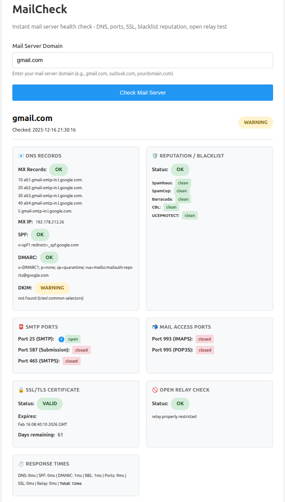

# MailCheck - Mail Server Health Monitoring

A minimal, stateless mail server health monitoring service using pure shell scripts with socat as the web server.

🌐 **Live instance available at:** [mailcheck.aurio.no](https://mailcheck.aurio.no)



## Features

- **MX Records Check** - Verifies mail server configuration
- **SSL/TLS Certificate Monitoring** - Checks SMTP certificate validity and expiration
- **DNS Records** - Validates SPF, DMARC, and DKIM records
- **Port Connectivity** - Tests SMTP (25, 587, 465), IMAP (993), POP3 (995)
- **RBL Blacklist Checks** - Tests against major spam blacklists (Spamhaus, SpamCop, etc.)
- **Open Relay Detection** - Security check for misconfigured mail servers
- **Simple HTTP Interface** - Clean POST-based API with configuration panel
- **Performance Metrics** - Response time tracking for all checks
- **Highly Configurable** - Frontend panel + environment variables for DKIM selectors, RBL servers, DNS servers
- **Fully Dockerized** - Pure shell, no Python/Node.js required
- **Lightweight** - Alpine-based, <50MB image

## Quick Start

### Prerequisites

- Docker (Docker Compose optional)

### Setup

1. Clone this repository:
```bash
git clone <your-repo>
cd mailcheck
```

2. Build and run:
```bash
./init.sh
```

Or manually with Docker:
```bash
docker build -t mailcheck:latest .
docker run -d \
  --name mailcheck \
  --restart unless-stopped \
  -p 8080:8080 \
  mailcheck:latest
```

3. Access the web interface:
```
http://localhost:8080
```

## What It Checks

### DNS Records
- **MX Records** - Mail server addresses and IP resolution
- **SPF Record** - Sender Policy Framework for anti-spoofing
- **DMARC Record** - Domain-based Message Authentication
- **DKIM Records** - Checks common selectors (default, selector1, selector2, google, k1, dkim, s1, s2, mail, email)

### Port Connectivity
- **Port 25** - Standard SMTP
- **Port 587** - SMTP Submission (recommended)
- **Port 465** - SMTP over SSL (legacy)
- **Port 993** - IMAP over SSL
- **Port 995** - POP3 over SSL

### SSL/TLS Certificates
- Certificate validity (tries ports 587, 465, 25 with STARTTLS)
- Expiration date and days remaining
- Status: ok (>30 days), warning (<30 days), error (expired)

### Security & Reputation
- **RBL Blacklist Check** - Tests against Spamhaus, SpamCop, Barracuda, CBL, UCEPROTECT
- **Open Relay Test** - Detects misconfigured mail servers that allow relaying

### Performance
- **Response Times** - Individual timing for each check component (DNS, ports, SSL, RBL, relay)

## Configuration

Configuration is done via **environment variables** at container startup:

### Environment Variables

- **`DKIM_SELECTORS`** - Comma-separated list of DKIM selector names to check
  - Default: `default,selector1,selector2,google,k1,dkim,s1,s2,mail,email`
  
- **`RBL_SERVERS`** - Blacklist servers in format `hostname:Name,hostname:Name,...`
  - Default: `zen.spamhaus.org:Spamhaus,bl.spamcop.net:SpamCop,b.barracudacentral.org:Barracuda,cbl.abuseat.org:CBL,dnsbl-1.uceprotect.net:UCEPROTECT`
  
- **`DNS_SERVERS`** - Comma-separated list of DNS resolver IPs
  - Default: `8.8.8.8,1.1.1.1`

**Example with custom configuration:**

```bash
docker run -d \
  --name mailcheck \
  -p 8080:8080 \
  -e DKIM_SELECTORS="default,google,microsoft" \
  -e RBL_SERVERS="zen.spamhaus.org:Spamhaus,bl.spamcop.net:SpamCop" \
  -e DNS_SERVERS="1.1.1.1,8.8.8.8" \
  mailcheck:latest
```

Or set them before running `./init.sh`:

```bash
export DKIM_SELECTORS="default,google"
export RBL_SERVERS="zen.spamhaus.org:Spamhaus"
export DNS_SERVERS="1.1.1.1"
./init.sh
```

## Usage

### Check a Mail Server

1. Visit http://localhost:8080
2. Enter the mail server domain (e.g., `gmail.com` or `yourdomain.com`)
3. Click "Check Mail Server"
4. View results:
   - MX records and IP address
   - SPF, DMARC, and DKIM records
   - Port connectivity (SMTP, IMAP, POP3)
   - SSL certificate validity and expiration
   - RBL blacklist status
   - Open relay security check
   - Performance timing for each component

## API Endpoints

### GET /
Serves the web interface.

### POST /check
Runs mail server health check.

**Request:**
```
POST /check
Content-Type: application/x-www-form-urlencoded

domain=example.com
```

**Response:**
```json
{
  "domain": "example.com",
    "status": "ok",
    "checked_at": "2025-12-15 12:34:56",
    "mx_records": "10 mail.example.com.",
    "mx_status": "ok",
    "mx_ip": "192.0.2.1",
    "spf_record": "v=spf1 include:_spf.example.com ~all",
    "spf_status": "ok",
    "dmarc_record": "v=DMARC1; p=quarantine",
    "dmarc_status": "ok",
    "dkim_status": "ok",
    "dkim_message": "found (default google)",
    "dkim_records": [
      "default: v=DKIM1; k=rsa; p=MIGfMA0GCSqGSIb3DQEBAQUAA4GNADCBiQKBgQC...",
      "google: v=DKIM1; k=rsa; p=MIIBIjANBgkqhkiG9w0BAQEFAAOCAQ8AMIIBCgKCAQEA..."
    ],
    "rbl_status": "ok",
    "rbl_message": "not listed on any blacklists",
    "rbl_results": [
      {"name": "Spamhaus", "status": "clean"},
      {"name": "SpamCop", "status": "clean"}
    ],
    "smtp_port_25": "open",
    "smtp_port_587": "open",
    "smtp_port_465": "closed",
    "imap_port_993": "open",
    "pop3_port_995": "closed",
    "smtp_ssl_valid": "valid",
    "smtp_ssl_expiry": "Jan 1 00:00:00 2026 GMT",
    "smtp_ssl_days_remaining": 382,
    "smtp_ssl_status": "ok",
    "open_relay_status": "ok",
    "open_relay_message": "relay properly restricted",
    "response_times": {
      "dns_ms": 123,
      "spf_ms": 45,
      "dmarc_ms": 67,
      "dkim_ms": 89,
      "rbl_ms": 234,
      "ports_ms": 345,
      "ssl_ms": 456,
      "relay_ms": 567,
      "total_ms": 1926
    }
}
```

**Error Response:**
```json
{
  "error": "Domain is required"
}
```

### GET /health
Health check endpoint.

**Response:**
```json
{
  "status": "ok"
}
```

## Architecture

- **Pure Shell** - No Python, Node.js, or other runtimes required
- **Socat HTTP Server** - Lightweight TCP server with bash request handling
- **Stateless** - No database, no persistent storage
- **On-demand** - Checks run only when requested by users
- **Timeout-protected** - Individual timeouts for each check component

Each check performs:
1. DNS lookups (MX, SPF, DMARC) with 5-second timeouts
2. DKIM record detection (tries 10 common selectors)
3. RBL blacklist queries against 5 major lists
4. Port connectivity tests (SMTP 25/587/465, IMAP 993, POP3 995)
5. SSL certificate validation with STARTTLS
6. Open relay security test (port 25)
7. Performance timing for all operations

## Development

### Building locally
```bash
docker build -t mailcheck:latest .
```

### Running rootless
The container runs as a non-root user (UID 1000) for improved security. This is configured automatically in the Dockerfile.

### Stopping the service
```bash
./stop.sh
```

Or manually:
```bash
docker stop mailcheck
docker rm mailcheck
```

### Viewing logs
```bash
docker logs -f mailcheck
```

### Testing the API
Using curl with default settings:
```bash
curl -X POST http://localhost:8080/check -d "domain=gmail.com"
```

With custom configuration:
```bash
curl -X POST http://localhost:8080/check \
  -d "domain=gmail.com" \
  -d "dkim_selectors=default,google" \
  -d "rbl_servers=zen.spamhaus.org:Spamhaus" \
  -d "dns_servers=1.1.1.1"
```

### Health check
```bash
curl http://localhost:8080/health
```

## Common Issues Detected

### DNS Issues
- **No MX records** - Domain cannot receive email (status: error)
- **Missing SPF** - Emails may be marked as spam (status: warning)
- **Missing DMARC** - No email authentication policy (status: warning)
- **Missing DKIM** - Cannot verify email signatures (status: warning, checks common selectors)

### Reputation Issues
- **RBL listed** - Mail server on spam blacklist (status: error)
- **Open relay detected** - Security vulnerability (status: error)

### Connectivity Issues
- **All SMTP ports closed** - Mail server unreachable
- **Port 25 shows closed but is actually open** - Many ISPs/hosting providers block outbound port 25 connections to prevent spam. This means the test cannot connect, but your mail server may still receive email from other servers. This is a **network limitation**, not a server issue.

### Certificate Issues
- **Certificate expiring <30 days** - Warning status
- **Certificate expired** - Error status
- **Certificate unavailable** - STARTTLS failed (status: warning)

## Limitations

- **Stateless** - No persistent monitoring or historical data
- **No authentication** - Publicly accessible (use reverse proxy for production)
- **No rate limiting** - Must be implemented via reverse proxy (nginx, Cloudflare, etc.)
- **DKIM selector detection** - Only tries configured selectors (customizable via frontend config)
- **Basic validation** - Domain format only, no advanced sanitization
- **Port 25 connectivity testing limited** - Many networks block outbound port 25 connections. If port 25 shows as "closed" but you know it's open, this is likely due to network-level blocking between the test server and your mail server. Real mail server-to-server communication will still work. Open relay tests may fail in this scenario.
- **RBL queries** - Dependent on external DNS services
- **Blocking requests** - Each request blocks during check (30s max)

## Security Considerations

This tool includes basic protections:
- ✅ Domain format validation and strict sanitization
- ✅ Timeout protection per check component
- ✅ Input sanitization to prevent command injection
- ✅ Runs as non-root user (UID 1000) in container

For public deployment, **MUST ADD**:
- **Reverse proxy** (Apache, nginx, Cloudflare) with rate limiting
- **CAPTCHA** or proof-of-work
- **Authentication/API keys**
- **DDoS protection** at network level
- **HTTPS/TLS** termination
- Monitoring and alerting for abuse

## License

BSD 2-Clause License

Copyright (c) 2025, itefixnet

See [LICENSE](LICENSE) file for full details.
